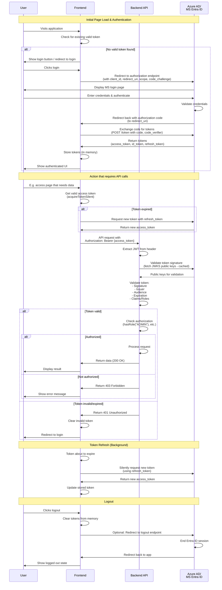

# Authorization and Authentication concept

This document shall conceptually explain the flow of authentication and authorization in this application, i.e. an application secured via MS EntraID with a single frontend and backend service, respectively. The setup is that both, the frontend and backend are registered in EntraID with their respective ID and secret. Also, the user's account needs to be given a role in the application in EntraID. 

